# 📘 MVP – Engenharia de Dados  
Análise de fundos de investimento  
Disciplina: Engenharia de Dados (40530010055_20260_01)

---
## 🧠 Contexto de Negócios

Investidores e analistas precisam comparar fundos de investimento considerando não apenas o retorno histórico, mas também o risco assumido e os custos envolvidos. Decisões baseadas apenas em retorno bruto podem levar a escolhas ineficientes, especialmente quando taxas elevadas reduzem o ganho líquido ou quando o risco é desproporcional ao retorno.

Este MVP implementa um pipeline de dados na nuvem para organizar, tratar e analisar informações de fundos de investimento, permitindo avaliar relações entre risco, retorno, categoria e custo, de forma estruturada e reproduzível.

Problema: compreender como risco, retorno, categoria e custos se relacionam no desempenho dos fundos de investimento analisados.

---

## 🎯 Perguntas de Negócio (Objetivo do MVP)

Este projeto foi desenvolvido para responder **quatro perguntas fundamentais** sobre fundos de investimento:

1️⃣ **Fundos com maior risco têm maior retorno?**  
2️⃣ **O índice Sharpe é consistente com o retorno real?**  
3️⃣ **Quais categorias têm melhor retorno ajustado ao risco?**  
4️⃣ **O custo (expense_ratio) impacta negativamente o retorno?**

Essas perguntas orientam toda a arquitetura Bronze–Silver–Gold e justificam a escolha do dataset.

---
## 📁 Estrutura do Projeto

- mvp-engenharia-de-dados/ — diretório raiz do projeto

- data/ — pasta com os dados utilizados no MVP
  - comprehensive_mutual_funds_data.csv — dataset original dos fundos
  

- notebooks/ — pasta com os notebooks do pipeline
  - 01_bronze_ingestao_fundos.py — ingestão dos dados brutos (Bronze)
  - 02_silver_tratamento_fundos.py — limpeza e padronização (Silver)
  - 03_gold_modelagem_analises.py — métricas e modelagem (Gold)
  - 04_analises_relatorio_final.py — análises e conclusões finais
  
    
- evidencias/ - prints do pipeline
  
- README.md — documentação principal do projeto

## 📥 Coleta dos Dados

O dataset utilizado neste MVP é o **Comprehensive Mutual Funds Dataset**, disponível publicamente no Kaggle.

- **Origem:** Kaggle – *Comprehensive Mutual Funds Dataset*
- **URL:** https://www.kaggle.com/datasets
- **Autor:** Comunidade Kaggle
- **Licença:** Open Data (uso permitido para fins educacionais)
- **Formato:** CSV
- **Registros:** ~1.800 fundos
- **Colunas:** 14 atributos financeiros (retorno, risco, categoria, taxa, etc.)

## 🧩 Visão Geral da Arquitetura
Este projeto implementa uma arquitetura **Bronze → Silver → Gold** para análise de fundos de investimento utilizando **Databricks + PySpark**.

O objetivo é responder quatro perguntas de negócio relacionadas a:

- risco  
- retorno  
- eficiência  
- categorias de fundos  

---

## 🏗️ Arquitetura do Projeto

### 🔶 Bronze — Dados Brutos
- Ingestão dos dados originais de fundos  
- Nenhuma transformação aplicada  
- Armazenamento fiel da fonte
- O arquivo CSV foi obtido do Kaggle e carregado no ambiente Databricks. A partir do arquivo disponibilizado no diretório de dados, o notebook 01_bronze_ingestao_fundos.py realizou a leitura e persistiu os dados na camada Bronze em formato Delta.  

---

### 🔷 Silver — Dados Tratados
- Limpeza e padronização  
- Conversão de tipos  
- Remoção de duplicatas  
- Tratamento de nulos  
- Normalização das colunas  
- Preparação para análises  

---

### 🟡 Gold — Métricas e Modelagem
Criação das tabelas analíticas:

- `gold_risco_retorno`
- `gold_sharpe_retorno`
- `gold_categoria`
- `gold_eficiencia`

Cada tabela responde diretamente a uma pergunta de negócio.

---
## 📊 Resultado das Perguntas

### **1️⃣ Fundos com maior risco têm maior retorno?**
**Não.**  
A correlação entre risco (desvio padrão) e retorno foi de **0.06**, indicando ausência de relação linear forte.

---

### **2️⃣ O índice Sharpe é consistente com o retorno real?**
**Não diretamente.**  
A correlação entre Sharpe e retorno foi de **0.03**, mostrando que Sharpe mede eficiência, não retorno bruto.

---

### **3️⃣ Quais categorias têm melhor retorno ajustado ao risco?**
- **Debt** foi a categoria mais eficiente  
- **Hybrid** ficou em segundo lugar  
- **Equity** teve maior risco e menor retorno no período analisado  

---

### **4️⃣ O custo (expense_ratio) impacta negativamente o retorno?**
**Sim.**  
Fundos com taxas menores (0.05–0.10) aparecem entre os mais eficientes.  
Fundos com taxas acima de 1.0 raramente têm boa eficiência.

---

## 📁 Notebooks do Projeto

### `01_bronze_ingestao`
- Leitura dos dados brutos  
- Armazenamento em formato Delta  

### `02_silver_tratamento`
- Limpeza  
- Padronização  
- Conversão de tipos  
- Preparação para análises  

### `03_gold_modelagem_analises`
- Criação das tabelas Gold  
- Cálculo de métricas  
- Verificação de qualidade analítica  

### `04_analises_relatorio_final`
- Cálculo das correlações  
- Análise das categorias  
- Avaliação da eficiência  
- Conclusões finais  

---
## 📸 Evidências do MVP — Engenharia de Dados

Todas as imagens abaixo foram geradas durante a execução do pipeline no Databricks, documentando cada etapa da arquitetura **Bronze → Silver → Gold → Análises**.

---

### 🟤 Etapa Bronze — Ingestão dos Dados
Leitura e visualização inicial da tabela bruta.

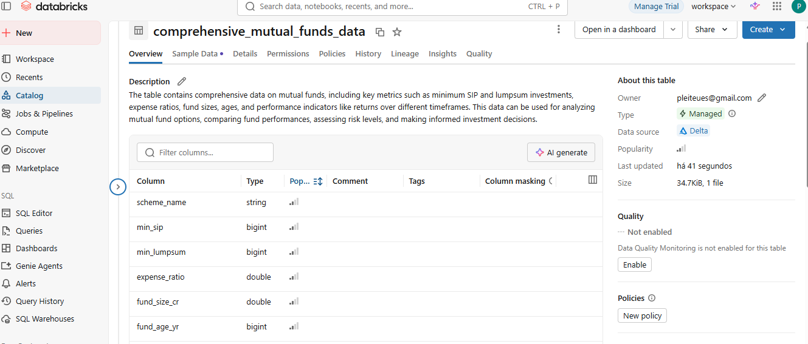

---

### ⚪ Etapa Silver — Tratamento e Padronização
Transformação dos dados brutos em dados limpos e prontos para análise.

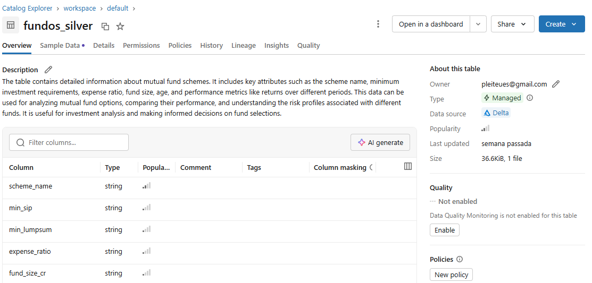

---

### 🟡 Etapa Gold — Modelagem Analítica
Criação das tabelas analíticas com métricas de risco, retorno e eficiência.

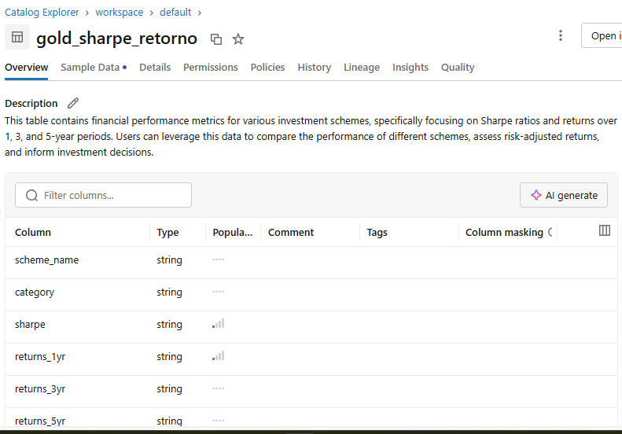
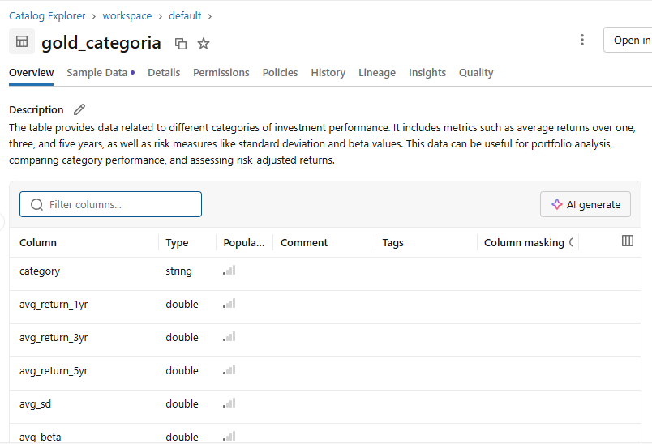
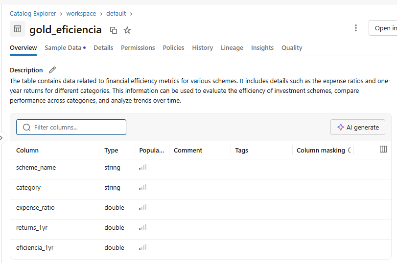
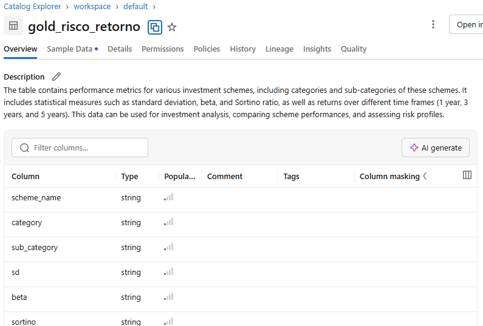

---

### 📚 Catálogo Completo
Visualização do schema `default` com todas as tabelas criadas.

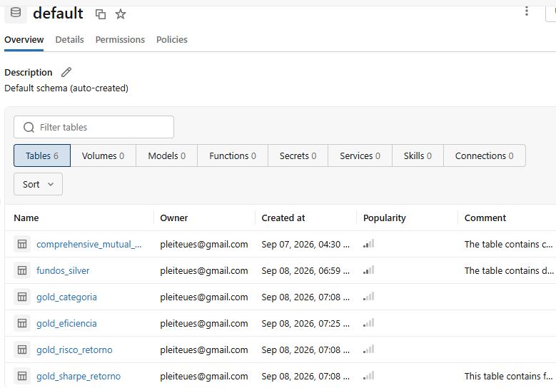

---

### ⚙️ Execução dos Notebooks
Evidências da execução das etapas do pipeline no Databricks.

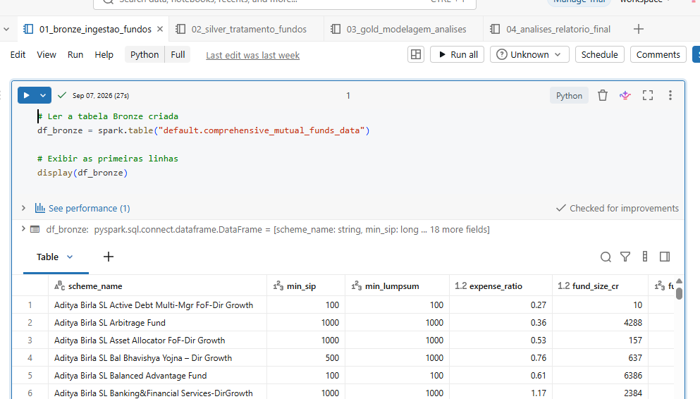
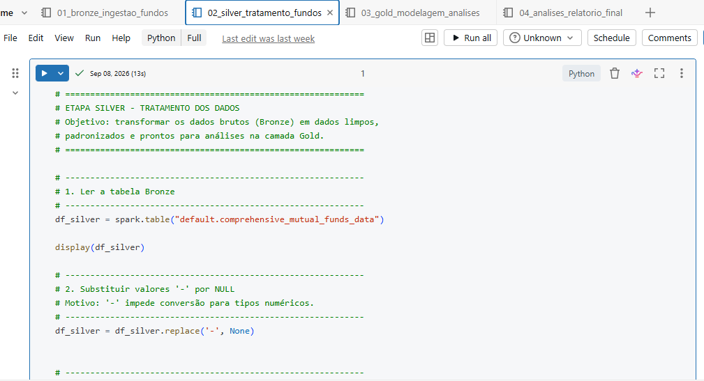
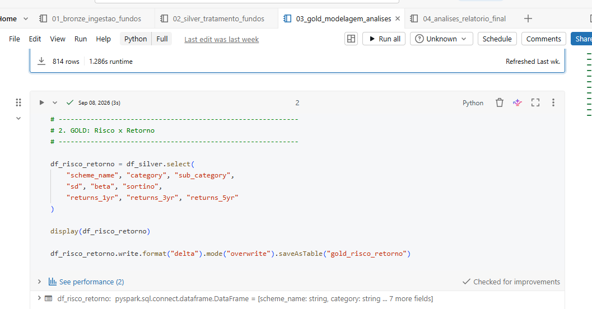
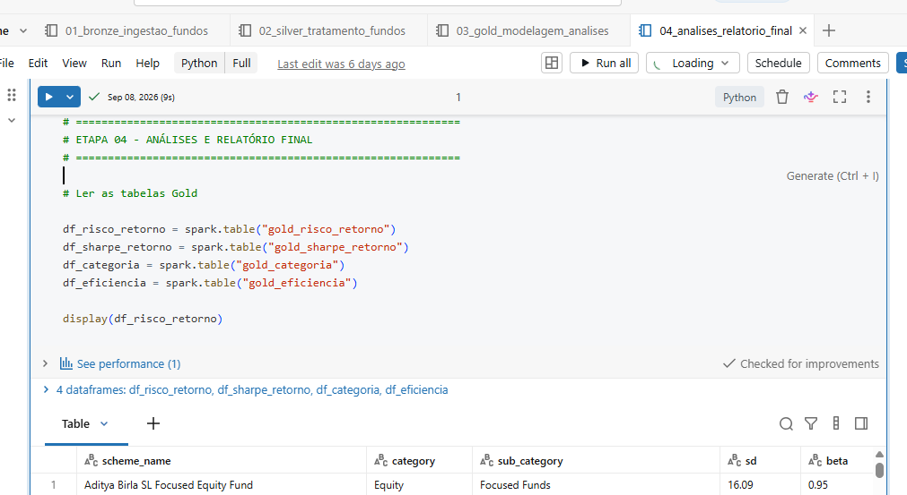

---

### 📊 Análises e Conclusões
Resultados das correlações e análises finais.

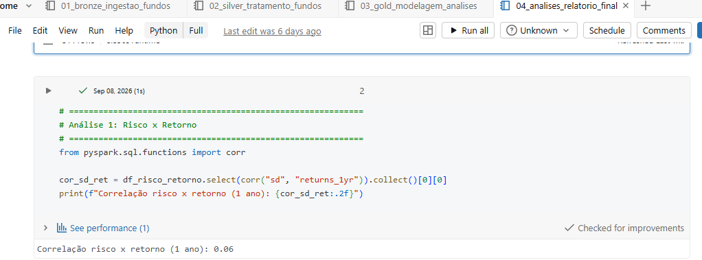
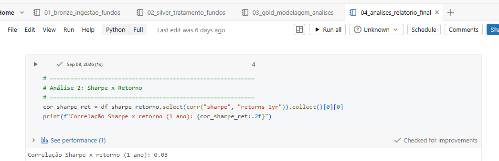

---

## 🧩 Conclusão Geral

O pipeline foi executado com sucesso, demonstrando a aplicação prática da arquitetura **Bronze–Silver–Gold** para análise de fundos de investimento.  
As evidências comprovam:
- ✅ Ingestão e padronização dos dados  
- ✅ Criação das tabelas analíticas  
- ✅ Execução completa dos notebooks  
- ✅ Análises quantitativas respondendo às perguntas de negócio  

O projeto documenta todo o processo de ponta a ponta e serve como referência para futuros trabalhos de engenharia de dados.

# 🧭 Autoavaliação

O MVP atingiu os principais objetivos propostos, permitindo implementar o pipeline e realizar análises sobre as quatro perguntas de negócio. Como limitações, destacam-se a ausência de automação, a utilização de uma única fonte de dados e a necessidade de ampliar as validações de qualidade e as visualizações

### 🚀 Possíveis evoluções futuras
- Implementar orquestração com Databricks Workflows ou Apache Airflow.
- Criar um modelo preditivo para estimar retorno ajustado ao risco.
- Adicionar testes automatizados para validação das transformações.
- Expandir o projeto para múltiplos datasets financeiros.

## 🛠️ Tecnologias Utilizadas
- Databricks  
- PySpark  
- Delta Lake  
- Spark SQL  
- Python  

---
